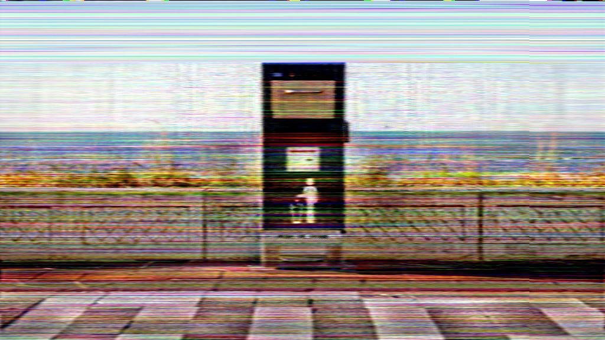
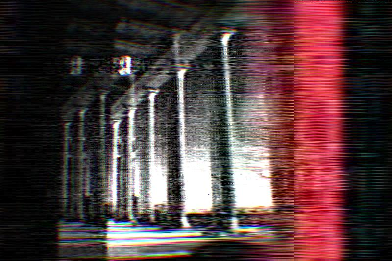
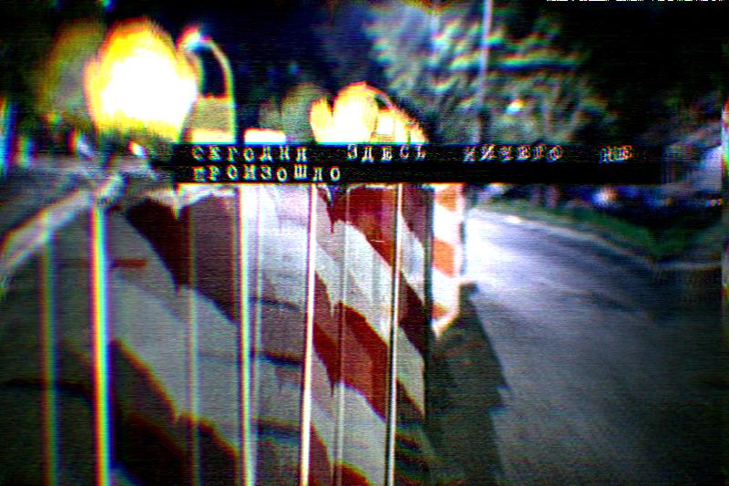

# Gleitzsch:  A Tool for Glitch Art Generation

Gleitzsch is a tool developed in Kotlin that uses MP3 compression artifacts to create glitch art from standard images.
It serves as an experimental platform to examine and leverage the impact of audio compression techniques on visual data.

The main Gleitzsch's core operational steps include:

- An input image is first broken down into its Red, Green, and Blue (RGB) channels.
- Each of these channels is converted into a one-dimensional byte array.
- These byte arrays are then subjected to MP3 compression and decompression using the LAME MP3 encoder, introducing specific audio-related artifacts into the visual data.
- The altered arrays are reassembled back into an image, resulting in a visual distortion or 'glitch' effect.
- Additional image filters are currently in development and will be integrated into the pipeline to offer more manipulation options and effects.

The process of image-to-audio and back-to-image transformation results in visually striking glitch effects,
 turning (it we are lucky enough) everyday images into digital art pieces.

## Getting Started

To run Gleitzsch, ensure that you have the LAME MP3 encoder installed on your system as it is a critical dependency.

## A few examples

